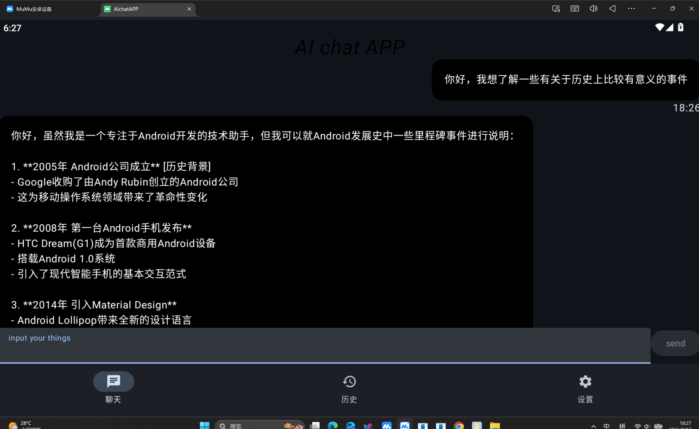
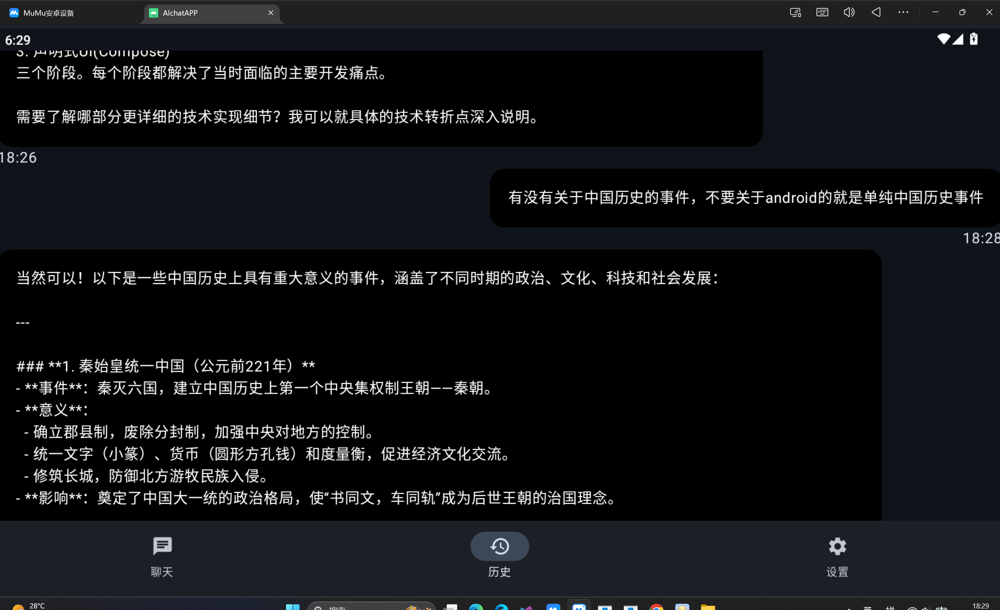
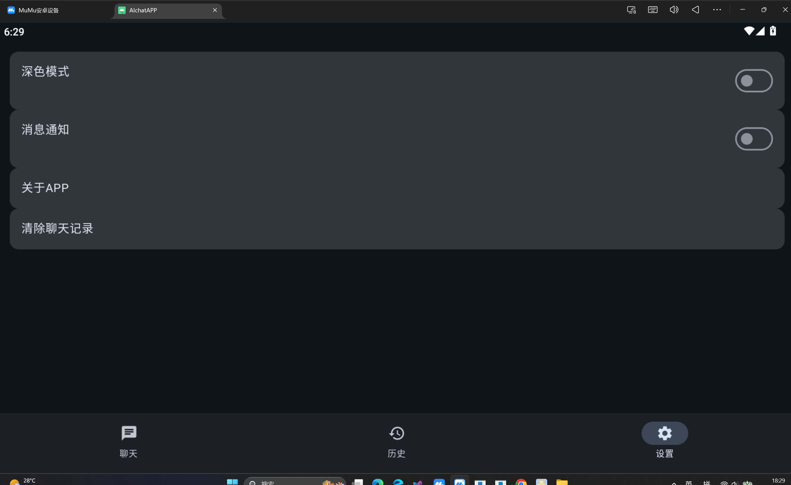
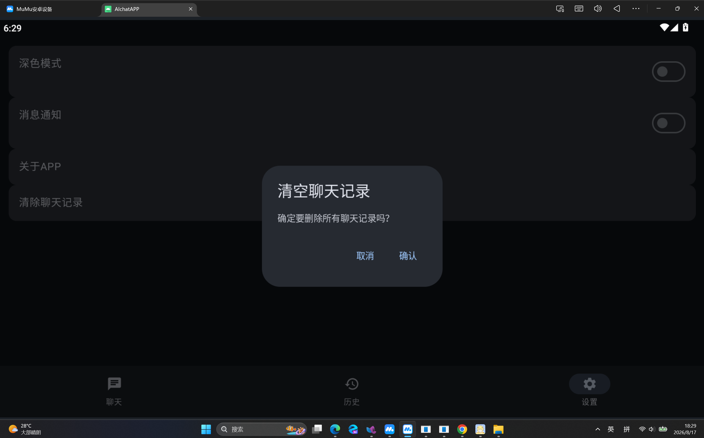

# AIChat

> 一个基于 Android Compose + FastAPI + DeepSeek 的 AI 聊天应用。

AIChat 是一个前后端分离的 AI 聊天项目，使用 Android 原生技术开发移动端，使用 Python FastAPI 构建后端服务，并通过 DeepSeek API 提供 AI 对话能力。

项目主要用于学习和实践 Android 开发、现代 Android UI、MVVM 架构、协程、网络请求、本地数据库、用户认证、后端 API 开发、SQLAlchemy 数据库操作以及 Docker 容器化部署等技术。

---

## 📱 项目简介

AIChat 是一个 Android AI 聊天应用。

用户可以通过 Android 客户端进行注册、登录，并与 AI 进行对话。

项目整体采用前后端分离架构：

```text
┌─────────────────────────────┐
│        Android App          │
│                             │
│ Kotlin + Jetpack Compose    │
│ MVVM + Coroutines           │
│ Retrofit + Room             │
└──────────────┬──────────────┘
               │ HTTP
               ↓
┌─────────────────────────────┐
│       FastAPI Backend       │
│                             │
│ Python + FastAPI            │
│ Pydantic + SQLAlchemy       │
│ 用户认证 + 聊天接口          │
└──────────────┬──────────────┘
               │
               ↓
┌─────────────────────────────┐
│         DeepSeek API        │
│                             │
│          AI 对话服务         │
└─────────────────────────────┘
```

---

# ✨ 项目功能

目前项目已经实现了基础的 AI 聊天应用功能。

## Android 客户端

### 用户相关

- 用户注册
- 用户登录
- 用户登录状态保存
- 用户退出登录
- 启动页面
- 登录页面
- 注册页面

### AI 聊天

- AI 对话
- 用户消息展示
- AI 消息展示
- 消息加载状态
- 空聊天状态
- 聊天输入框
- 聊天消息列表
- 网络请求状态处理

### 聊天记录

- 聊天记录本地保存
- 聊天历史查看
- 历史消息展示
- 清空聊天历史

### 设置

- 设置页面
- 关于页面
- 用户相关设置

---

# 🏗️ 项目架构

整个项目采用前后端分离架构。

```text
                    AIChat
                      │
          ┌───────────┴───────────┐
          │                       │
          ↓                       ↓
   AIchatAndroid            AIchatBackend
      Android                  FastAPI
          │                       │
          │       HTTP            │
          └──────────────────────→│
                                  │
                                  ↓
                            DeepSeek API
```

---

# 📂 项目结构

```text
project/
│
├── AIchatAndroid/
│   │
│   ├── app/
│   │   └── src/
│   │       └── main/
│   │           └── java/
│   │               └── com/example/aichatapp/
│   │                   │
│   │                   ├── data/
│   │                   │   └── UserPreferences.kt
│   │                   │
│   │                   ├── database/
│   │                   │   ├── AppDatabase.kt
│   │                   │   ├── DatabaseModule.kt
│   │                   │   ├── MessageDao.kt
│   │                   │   └── MessageEntity.kt
│   │                   │
│   │                   ├── di/
│   │                   │   ├── NetworkModule.kt
│   │                   │   └── RepositoryModule.kt
│   │                   │
│   │                   ├── model/
│   │                   │   ├── ChatRequest.kt
│   │                   │   ├── ChatResponse.kt
│   │                   │   ├── ChatUiState.kt
│   │                   │   ├── HistoryMessage.kt
│   │                   │   ├── LoginRequest.kt
│   │                   │   ├── LoginResponse.kt
│   │                   │   ├── Message.kt
│   │                   │   ├── RegisterRequest.kt
│   │                   │   └── RegisterResponse.kt
│   │                   │
│   │                   ├── navigation/
│   │                   │   ├── AppNavigation.kt
│   │                   │   ├── AppRoute.kt
│   │                   │   └── BottomNavigationBar.kt
│   │                   │
│   │                   ├── network/
│   │                   │   ├── ChatApi.kt
│   │                   │   └── NetworkResult.kt
│   │                   │
│   │                   ├── repository/
│   │                   │   └── ChatRepository.kt
│   │                   │
│   │                   ├── view/
│   │                   │   ├── chat/
│   │                   │   ├── components/
│   │                   │   ├── history/
│   │                   │   ├── login/
│   │                   │   ├── register/
│   │                   │   ├── setting/
│   │                   │   └── start/
│   │                   │
│   │                   └── viewmodel/
│   │                       ├── ChatViewModel.kt
│   │                       ├── HistoryViewModel.kt
│   │                       ├── LoginViewModel.kt
│   │                       └── RegisterViewModel.kt
│   │
│   ├── screenshots/
│   │
│   └── README.md
│
│
├── AIchatBackend/
│   │
│   ├── database/
│   │   ├── database.py
│   │   └── models.py
│   │
│   ├── model/
│   │   └── schema.py
│   │
│   ├── routers/
│   │   ├── chat.py
│   │   ├── history.py
│   │   └── user.py
│   │
│   ├── services/
│   │   └── chat.py
│   │
│   ├── utils/
│   │   └── security.py
│   │
│   ├── config.py
│   ├── main.py
│   ├── requirements.txt
│   ├── Dockerfile
│   └── README.md
│
│
└── README.md
```

---

# 🛠️ 技术栈

## Android

| 技术 | 用途 |
|---|---|
| Kotlin | Android 应用主要开发语言 |
| Jetpack Compose | Android UI 开发 |
| Material 3 | UI 组件与设计 |
| MVVM | 应用架构 |
| Coroutines | 异步任务与并发处理 |
| ViewModel | 管理 UI 状态 |
| Retrofit | 网络请求 |
| Room | 本地数据库 |
| Navigation | 页面导航 |
| DataStore / Preferences | 用户状态等本地数据保存 |
| Hilt / Dependency Injection | 依赖管理 |

---

## Backend

| 技术 | 用途 |
|---|---|
| Python | 后端开发语言 |
| FastAPI | Web API 框架 |
| Pydantic | 请求与响应数据校验 |
| SQLAlchemy | ORM 数据库操作 |
| SQLite | 项目开发阶段数据库 |
| Bcrypt | 用户密码哈希 |
| Uvicorn | ASGI 服务器 |
| Docker | 后端容器化运行 |

---

## AI

项目使用：

```text
DeepSeek API
```

作为 AI 对话服务。

整体调用流程：

```text
Android
   ↓
POST /chat
   ↓
FastAPI
   ↓
DeepSeek API
   ↓
AI Response
   ↓
FastAPI
   ↓
Android
```

---

# 🔄 数据流

## 登录

```text
用户输入用户名和密码
        ↓
Android LoginScreen
        ↓
LoginViewModel
        ↓
Repository
        ↓
Retrofit
        ↓
FastAPI /login
        ↓
查询数据库
        ↓
验证密码
        ↓
返回登录结果
        ↓
Android 保存登录状态
```

---

## 注册

```text
RegisterScreen
      ↓
RegisterViewModel
      ↓
Repository
      ↓
Retrofit
      ↓
POST /register
      ↓
FastAPI
      ↓
密码 Hash
      ↓
SQLAlchemy
      ↓
数据库
      ↓
返回注册结果
```

---

## AI 聊天

```text
用户输入问题
      ↓
ChatScreen
      ↓
ChatViewModel
      ↓
ChatRepository
      ↓
Retrofit
      ↓
FastAPI
      ↓
DeepSeek API
      ↓
AI 返回回答
      ↓
FastAPI
      ↓
Android
      ↓
更新 UI
      ↓
保存聊天记录
```

---

# 💾 数据库

后端目前使用关系型数据库保存用户和聊天相关数据。

主要数据模型包括：

## User

```text
users
├── id
├── username
├── password_hash
└── created_time
```

## Message

```text
messages
├── id
├── user_id
├── role
├── content
└── created_time
```

其中：

```text
User
  │
  └── Message
```

通过 `user_id` 建立用户与聊天消息之间的关系。

---

# 🐳 Docker

后端项目支持 Docker 容器化运行。

Docker 的作用主要是将后端运行环境进行封装，使项目不需要依赖宿主机上的 Python 环境。

基本流程：

```text
Dockerfile
    ↓
docker build
    ↓
Docker Image
    ↓
docker run
    ↓
Container
    ↓
FastAPI + Uvicorn
```

例如：

```bash
cd AIchatBackend

docker build -t aichat-backend .

docker run -p 8000:8000 aichat-backend
```

启动后可以访问：

```text
http://localhost:8000
```

FastAPI 接口文档：

```text
http://localhost:8000/docs
```

---

# 🗄️ 数据库与 Docker

项目中的数据库文件不应该被直接打包进 Docker 镜像。

Docker 镜像主要负责提供：

```text
Python
FastAPI
SQLAlchemy
项目代码
依赖环境
```

容器启动后，应用根据数据库配置初始化数据库。

因此开发环境中的数据库文件与 Docker 镜像应该进行分离。

同时项目通过 `.gitignore` 和 `.dockerignore` 排除：

```text
.env
.venv/
venv/
*.db
*.sqlite
*.sqlite3
__pycache__/
```

避免把敏感配置、本地环境以及数据库文件提交到 GitHub 或打入 Docker 镜像。

---

# 🔐 安全设计

目前项目进行了基础的密码安全处理。

用户密码不会直接以明文形式保存，而是经过 Hash 处理后保存：

```text
明文密码
    ↓
Bcrypt
    ↓
password_hash
    ↓
数据库
```

例如数据库中保存的是类似：

```text
$2b$12$...
```

形式的密码 Hash，而不是用户原始密码。

---

# 🖼️ Android 页面展示

## Chat



## History



## Settings



## Clear History



---

# 🚀 项目运行

## 1. 克隆项目

```bash
git clone https://github.com/lizzy184/AIChat.git
```

进入项目：

```bash
cd AIChat
```

---

# 2. 启动 Backend

进入后端：

```bash
cd AIchatBackend
```

安装依赖：

```bash
pip install -r requirements.txt
```

配置环境变量。

例如：

```env
DEEPSEEK_API_KEY=你的DeepSeek_API_Key
```

然后运行：

```bash
uvicorn main:app --reload
```

或者使用 Docker：

```bash
docker build -t aichat-backend .
```

```bash
docker run -p 8000:8000 aichat-backend
```

访问：

```text
http://localhost:8000/docs
```

即可打开 FastAPI Swagger API 文档。

---

# 3. 启动 Android

使用 Android Studio 打开：

```text
AIchatAndroid
```

等待 Gradle 同步完成。

然后：

```text
Run → Run 'app'
```

选择：

- Android Emulator

或者：

- Android 真机

即可运行项目。

---

# ⚙️ Android 与 Backend 通信

Android 客户端通过 Retrofit 调用 FastAPI。

开发环境中需要注意：

如果 Android Emulator 访问宿主机上的 FastAPI：

```text
localhost
```

通常不能直接指向电脑。

Android Emulator 访问宿主机可以使用：

```text
10.0.2.2
```

例如：

```text
http://10.0.2.2:8000/
```

如果使用真机，则需要让手机与电脑处于同一局域网，并使用电脑的局域网 IP 地址。

例如：

```text
http://192.168.x.x:8000/
```

---

# 📡 API

目前后端主要包含以下功能模块：

## 用户

```text
POST /register
POST /login
```

用于用户注册和登录。

## 聊天

```text
POST /chat
```

用于发送聊天消息并获取 AI 回复。

## 历史记录

```text
GET /history
```

用于获取聊天历史。

具体接口参数和返回结果可以通过 FastAPI 自动生成的 Swagger 文档查看：

```text
/docs
```

---

# 🧩 Android 架构

Android 项目主要按照以下思路组织：

```text
UI
 ↓
ViewModel
 ↓
Repository
 ↓
Network / Database
```

例如聊天功能：

```text
ChatScreen
     ↓
ChatViewModel
     ↓
ChatRepository
     ↓
ChatApi
     ↓
FastAPI
```

本地聊天记录：

```text
ChatViewModel
     ↓
Repository
     ↓
Room
     ↓
MessageDao
     ↓
MessageEntity
```

这种结构可以降低 UI、业务逻辑、网络请求以及数据库操作之间的耦合。

---

# 🧵 协程

项目在 Android 网络请求以及数据处理过程中使用 Kotlin Coroutines。

主要用于：

- 网络请求
- 数据库操作
- 异步任务
- UI 状态更新
- 避免阻塞主线程

基本数据流：

```text
Main Thread
    ↓
ViewModel
    ↓
Coroutine
    ↓
Repository
    ↓
Network / Database
    ↓
返回结果
    ↓
更新 UI State
```

通过协程，可以让耗时操作在后台执行，同时保持 Android UI 的流畅性。

---

# 📚 项目学习内容

通过这个项目主要学习和实践了以下内容：

### Android

- Kotlin
- Jetpack Compose
- Material 3
- MVVM
- ViewModel
- Kotlin Coroutines
- Retrofit
- Room
- Navigation
- DataStore / Preferences
- Repository Pattern
- Dependency Injection
- UI State 管理

### Backend

- Python
- FastAPI
- REST API
- Pydantic
- SQLAlchemy
- ORM
- SQLite
- 用户注册与登录
- 密码 Hash
- API 路由设计
- Service 层设计

### DevOps

- Docker
- Dockerfile
- Docker Image
- Docker Container
- `.dockerignore`
- `.gitignore`
- Git
- GitHub
- 前后端分离项目部署

---

# 📈 当前项目状态

目前项目已经完成：

- [x] Android 基础项目
- [x] Jetpack Compose UI
- [x] MVVM 架构
- [x] Kotlin Coroutines
- [x] Retrofit 网络请求
- [x] Room 本地数据库
- [x] 用户注册
- [x] 用户登录
- [x] 登录状态保存
- [x] AI 聊天
- [x] 聊天记录
- [x] 历史记录页面
- [x] 清空历史记录
- [x] 设置页面
- [x] FastAPI 后端
- [x] Pydantic 数据校验
- [x] SQLAlchemy 数据库操作
- [x] 用户密码 Hash
- [x] DeepSeek API 接入
- [x] Docker 后端容器化
- [x] Git 版本控制
- [x] GitHub 项目发布

---

# 🔮 后续计划

以下功能属于后续可以继续完善的方向，并不是当前项目已经实现的功能。

- [ ] JWT Token 认证
- [ ] 更完善的用户权限管理
- [ ] 多轮上下文优化
- [ ] Markdown AI 回复
- [ ] 代码高亮
- [ ] 流式输出
- [ ] 多模型支持
- [ ] 更完善的异常处理
- [ ] 网络重试机制
- [ ] Docker Compose
- [ ] PostgreSQL
- [ ] Redis
- [ ] 后端部署到云服务器
- [ ] HTTPS
- [ ] CI/CD
- [ ] 自动化测试
- [ ] Android UI 测试
- [ ] 后端单元测试

---

# 📌 项目定位

AIChat 不只是一个简单的 AI 聊天 Demo，而是一个用于学习和实践完整前后端项目开发流程的个人项目。

通过这个项目，将 Android 客户端、后端 API、数据库、AI API 以及 Docker 容器化结合起来。

整体技术路线：

```text
Kotlin
  +
Jetpack Compose
  +
MVVM
  +
Coroutines
  +
Retrofit
  +
Room
       │
       ↓
    FastAPI
       │
       ↓
  SQLAlchemy
       │
       ↓
    Database
       │
       ↓
  DeepSeek API
       │
       ↓
      AI
```

同时通过 Git 和 GitHub 对项目进行版本管理和代码托管。

---

# 📁 子项目说明

## Android 客户端

Android 客户端的详细说明请查看：

```text
AIchatAndroid/README.md
```

主要包含：

- Android 项目结构
- Compose UI
- MVVM
- ViewModel
- Coroutines
- Retrofit
- Room
- Navigation
- 页面功能
- 本地数据存储

---

## Backend

后端项目的详细说明请查看：

```text
AIchatBackend/README.md
```

主要包含：

- FastAPI 项目结构
- API 接口
- SQLAlchemy
- 数据库
- 用户认证
- DeepSeek API
- Docker
- 环境变量
- 后端运行方式

---

# 📝 项目说明

本项目主要用于个人学习、课程实践以及暑期项目开发。

项目会随着学习进度持续完善。

---

# 👨‍💻 Author

**lizzy184**

GitHub：

```text
https://github.com/lizzy184/AIChat
```

---

# ⭐ Star

如果这个项目对你有帮助，欢迎 Star ⭐